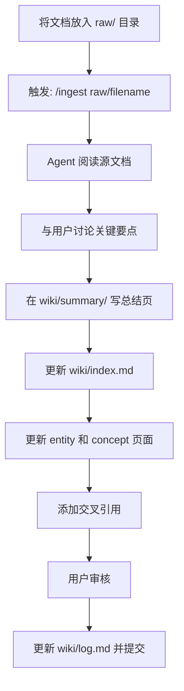

# 使用 Trae Agent 搭建 LLM Wiki 知识库

## 主要想法

### 什么是 LLM Wiki

[LLM Wiki Pattern](https://gist.github.com/karpathy/442a6bf555914893e9891c11519de94f)是karpathy提出的一种使用大型语言模型构建和维护个人知识库的核心模式。与传统 RAG（检索增强生成）系统每次查询时从文档中重新检索不同，Wiki Pattern 强调**持久化积累**——知识被编译一次，然后保持最新状态，无需每次查询时重新派生。

简单来说：让 LLM 从"每次查询的临时工"变成 wiki 的"专职维护者"。

核心组件三层架构：
- **Raw Sources**：不可变的源文档集合，用户的资料来源
- **Wiki**：LLM 生成的 markdown 文件目录（总结页、实体页、概念页等）
- **Schema**：告诉 LLM 如何维护 wiki 的规范文档（如 AGENTS.md）

我按照 LLM Wiki Pattern 架建了一个知识库，用于存储和管理我的个人知识。不同于Karpathy的想法，我是用Trae替换了Obsidian（前端IDE）和Claud Agent，使用最简单方法实现。请参考这个项目：
- Gitee: https://gitee.com/d0ngw/neo-wiki
- Github mirror: https://github.com/D0ngWen/neo-wiki

### LLM Wiki 解决了什么问题

| 痛点 | 传统方案 | Wiki Pattern |
|------|----------|--------------|
| 知识碎片化 | 每次查询重新检索 | 持久积累，预先综合 |
| 交叉引用缺失 | 临时建立，容易遗漏 | 预先建立，持续维护 |
| 矛盾未追踪 | 每次可能重新发现 | 预先标记，明确记录 |
| 维护负担重 | 人类难以坚持 | LLM 承担文书工作 |

> 核心洞察：维护知识库最繁琐的不是阅读或思考，而是文书工作——更新交叉引用、保持摘要最新、维护一致性。人类放弃 wiki 是因为维护负担增长比价值快。LLM 不会厌倦、不会忘记，可以一次触及多个文件。

## 使用 Trae 实现简单 LLM Wiki

### Roles 角色分工

在 LLM Wiki Pattern 中，人和 Agent 有明确的角色分工：

| 角色 | 职责 |
|------|------|
| **Human（人类）** | 策划源文档、提出问题、审核结果 |
| **Trae Agent** | 撰写和维护所有 wiki 文件 |

**详细职责说明**：

- **你的工作**：
  - 将文章、论文、笔记放入 `raw/` 目录
  - 提出好问题引导分析
  - 审核 Agent 的输出结果

- **Agent 的工作**：
  - 总结源文档内容
  - 维护页面间的交叉引用
  - 归档整理 wiki 结构
  - 记录操作日志

### 方案框架

```
neo_wiki/
├── AGENTS.md          # Schema：Agent 工作规范
├── raw/               # 不可变的源文档
│   └── *.md           # 原始文档
└── wiki/              # Agent 生成的 wiki 页面
    ├── README.md      # 介绍
    ├── index.md       # 内容目录
    ├── log.md         # 操作日志
    ├── summary/       # 源文档总结
    ├── concept/       # 概念页
    └── entity/       # 实体页
```

**核心触发词**：

| 触发词 | 操作 | 说明 |
|--------|------|------|
| `/ingest` | 摄入新源 | 添加文档到 wiki |
| `/query` | 查询 | 提问并综合答案 |
| `/lint` | 健康检查 | 检查矛盾、孤立页面等 |

### Ingest Workflow

将新源文档摄入 wiki 的标准流程：



**使用示例**：
1. 添加源文档: `cp article.md neo-wiki/raw/`

2. 触发 Agent: `/ingest raw/article.md`

3. Agent 自动完成自动完成ingest workflow

## 总结

我理解LLM Wiki的模式是为了节省重复性的劳动工作，但是也有很多不同批评Karpathy的看法，认为LLM Wiki节省了人类自身神经网络的步骤，并不会使人类更好的做学习研究。Karpathy也提到了这个idea的一个问题，raw文件目录下文件超过100个时，会使Agent维护负担重，还是需要类似RAG的embedding模式来优化。

我的wiki项目也只是使用Trae方案的最简单实验，我主要用户个人知识库学习和记录，日后我会在使用中查看效果。
